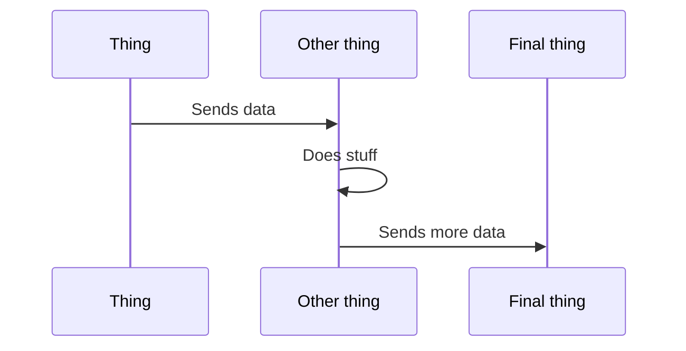

# Design Documentation Template
The following is a helpful starter template for a design document. Design docs should be written in markdown and PR'd into the `TBD` folder in the mric-docs repo. 

Whilst this is a template, it's _not_ exhaustive and may include things you don't need. The key is to convey meaning in a logical way for a new reader who doesn't hold all the knowledge in their heads that you do. 

---- 

# Design for Feature X

|Author| Reviewers |
|--|--|
|My Name | Names of interested parties |

## Context
Briefly explain the business context and the problem space here. 

## Proposal
Use human-readable language to describe the design of the new feature. If you can, add diagrams - mermaid / draw.io / hand sketched - anything to convey meaning. Start with the design-in-a-nutshell, and then expand into more detail as needed. 

### Sub Component 1
More detail about a sub component here, technologies used

### Sub Component 2
Etc.

## Supporting Evidence
Reference any relevant documentation / spikes + what you discovered from them.

## Considerations
Be honest about the advantages and disadvantages - what is _not_ ideal about this design?

## Unknowns
What do we not know, and how will we get to a place where we do? Reference issues in the repo here that need to be resolved.

What are the risks?

## Alternatives Considered
Use this section to outline other alternatives that you have looked into. Explain the pro's and cons of each, and why you're not proposing them. 

### Alternative 1
etc.

### Alternative 2
etc.
